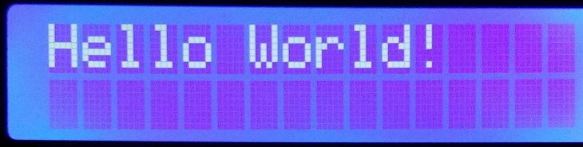
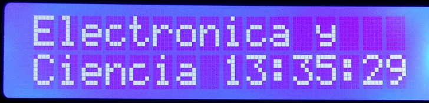
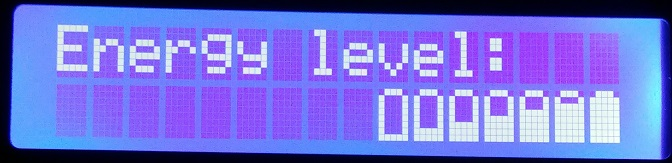
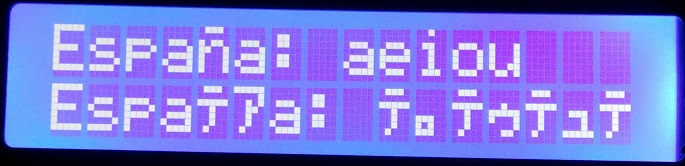

# Software I2C LCD for Raspberry PI
This is a C library that you can use to connect a PCF8574 based LCD to any of your available GPIO ports. It is feature rich and uses software emulated I2C bus.

## Getting Started

For a quick start guide, please follow these steps:

- Install Gordon's WiringPi library. 
- Download these 4 files and place them into your project directory.
  - [soft_i2c.c](soft_i2c.c)
  - [soft_i2c.h](soft_i2c.h)
  - [soft_lcd.c](soft_lcd.c) 
  - [soft_lcd.h](soft_lcd.h) 
- Include ```soft_lcd.h``` file in your main project.
- Learn commands from the examples.
- And don't forget to include the source files and wiringPi library when compiling:
```
gcc -lwiringPi -o example_basic example_basic.c soft_lcd.c soft_i2c.c
```

If you want to use pins 8 and 9, please notice these are hardware enabled I2C pins. So make sure you unloaded i2c kernel modules before using these routines.

```
rmmod i2c_dev 
rmmod i2c_bcm2708
```

As a rule, always ensure the pins you are using to simulate I2C bus are not taken over by any other software in the background.

### Examples

These are some files that you can use as a quick start guide.

If you want to compile and run them, make sure you modify lcd_create line to match your pin numbers and PCF8574's I2C address.

#### [example_basic.c](example_basic.c)

This is a very basic example. It shows to you how to configure a LCD with the predefined defaults and write some text. That with only a few lines.



If you want to try it, just modify the *lcd_create* line to set up your ports. Remember to use WiringPi numbers.

#### [example_intermediate.c](example_intermediate.c)

This is a slightly more complicated example. It shows to you how create a LCD, write test, reposition cursor and check for errors.

It is a clock that displays the string "Electronica y Ciencia" and the current time, updating 10 times a second.



#### [example_custom.c](example_custom.c)

Reading this example you will learn how to create and show custom characters.



#### [example_utf8.c](example_utf8.c)

Reading this example you will learn the effect of UTF8 character replacement.




## Usage

There are several levels to use this library:

 - **Basic level**: just power on the LCD and display some messages.
 - **Intermediate level**: the above plus some convenient functions like cursor position, clearing screen, cursor types, backlight control or custom characters.
 - **Advanced level**: you know how to use LCDs and the different options and commands they have. You want to have plenty of control over all LCD configurations.

First of all, include header file in your main program:
```c
#include "soft_lcd.h"
```

Since this is not a precompiled library, you need to add the source file of LCD and I2C to gcc compile line.
```
gcc -lwiringPi -o example_basic example_basic.c soft_lcd.c soft_i2c.c
```


### Usage (level: basic)

#### Describe the LCD

This library assumes that:
 - you are using an LCD based on HD44780 controller
 - you talk to it via I2C 8-Bit Expander like PCF8574.

If you don't know what all those means, then translate it by **this library works like charm with $3 Ebay's I2C LCD**.

In order to communicate with an LCD you need to specify:
 - A pin number for I2C SCL line (wiringPi numeration)
 - A pin number for I2C SDA line (wiringPi numeration)
 - An I2C address for the I2C device (0x3f usually).
 - The number of lines in the LCD (1, 2 or 4 character lines).

It returns a LCD structure you have to pass to every function in the libray. Note that you may have several LCD at the same time.

```c
lcd_t *lcd_create(int scl, int sda, int addr, int lines);
```

It initializes a new I2C bus. Then tries to communicate with PCF8574 driver and reset the LCD to a known state. If it goes all right, it returns a new lcd_t structure with the default configuration.

You can have as many LCDs as you need, each connected to different GPIO pins, or in the same if you use different address for the driver.

If you set the wrong pin numbers, I2C bus is busy or not pulled up, your power supply is not ready o LCD driver is defective, or any other error condition, it will return NULL.

```c
/* Create a LCD given SCL, SDA and I2C address, two lines */
lcd_t *lcd = lcd_create(23, 24, 0x3f, 2);

if (lcd == NULL) {
	printf("Cannot set-up LCD.\n");
	return 1;
}
```

#### Print text
This function displays the text given by *string* parameter in the LCD created before at the current cursor position. It overwrites the existing text.

```c
/* Print a string */
lcd_print(lcd, "Hello World!");
```

##### UTF8 character replacement
There is an integrated *character replacement* function. If you try to print non-standard 2 byte UTF8 characters like **ÁÉÍÓÚÑáéíóúñ** they will be replaced by a 1 byte equivalent. You can disable this behaviour unsetting a flag in the LCD structure.

```c
/* Disable characters replacement and print a string */
lcd->replace_UTF8_chars = 0;
lcd_print(lcd, "España: áéíóú");
```

See [example_utf8.c](example_utf8.c) to learn more about this.

#### Set text position
This function moves the cursor to the position given by *row* and *col* parameters. 

```c
lcd_pos(lcd_t *lcd, int row, int col);
```

Row and Col start at 0; so the first row is 0, the second is 1, and so on. The same for columns. 

The home position is 0,0.

```c
/* Move the cursor to the start of the second line */
lcd_pos(lcd, 1, 0);
```

#### Free the LCD
This function may be called at the end of your program. It is optional. If you don't call it, then the LCD just shows the last message until you disconnect the power supply after your program ends.

It turns off the display, the backlight and frees the memory. 

```c
/* Turn off LCD and free the memory */
lcd_destroy(lcd);
```

### Usage (level: intermediate)

#### Clear display

This function clears all text, return the display to the home position if shifted and moves cursor to the top left corner.

```c
/* Clear all contents */
lcd_clear(lcd);
```

#### Return to home 
This function return the display to the home position if shifted and moves cursor to the top left corner.

It is different from *lcd_pos* because this only moves the cursor, but does not affect shifting.

```c
/* Return cursor and display to top-left */
lcd_home(lcd);
```

#### LCD and backlight

Turns LCD ON (default) or OFF. When the LCD is on, the display data can be displayed instantly. When the LCD is off, the display data remains in RAM, and can be displayed instantly by switching it to ON.
```c
lcd_on(lcd);
lcd_off(lcd);
```

The backlight functions turns the backlight ON (default) or OFF.

```c
lcd_backlight_on(lcd);
lcd_backlight_off(lcd);
```
   
#### Cursor style

Make cursor visible or invisible (default). Enable or disable (default) cursor blinking.

```c
lcd_cursor_on(lcd);
lcd_cursor_off(lcd);
lcd_blink_on(lcd);
lcd_blink_off(lcd);
```

#### Create custom characters

The function *lcd_create_char* allows you to add up to 8 custom characters to the predefined characters set.

```
void lcd_create_char(lcd_t *lcd, int n, char *data);
```

The arguments are:
 - The LCD structure you want to operate
 - The position you want to store the custom char: 0 to 8
 - The 8 position binary string that defines the character (see example below).

It stores a custom 5x8 character in the position *n* of the Character Generator RAM. You can use these characters later with codes 0x00 to 0x07.

Please note that character 0x00 is not allowed inside a string, making this character actually not usable with basic and intermediate functions.

To make a custom character you need to create a binary array.
```c
char mychar[] = {
	0b01110,
	0b10001,
	0b10001,
	0b10001,
	0b10001,
	0b10001,
	0b10001,
	0b11111
};

lcd_create_char(lcd, 2, mychar);

lcd_print(lcd, "My char: \02");
```

#### Checking for errors
Each and every I2C commands sent to PCF8574 must be acknowledged. If PCF8574  fails to ack a command, the current function stops and set the error flag.

This is uncommon, and due to I2C interference or misfunction.

Checking the error condition, you can take appropiate measures like showing a message by another mean or resetting the LCD; but the last will not always be possible.

You check for error looking al *err* member of the LCD structure. This flag is only cleared in initialization.

```c
if (lcd->err) {
	fprintf(stderr, "LCD error detected!\n");
    
	usleep(100000);
    
	lcd_reset(lcd);
	lcd_init(lcd);
	lcd_pos(lcd, 0,0);
	lcd_print(lcd, "Error");
    
	return 1;
}
```


### Usage (level: advanced)

#### void lcd_reset (lcd_t *lcd);
Performs an initialization procedure as described at "Initializing by Instruction" section of HD44780 datasheet.

#### void lcd_init(lcd_t *lcd);
Performs a configuration of the LCD, issuing *lcd_reconfig*, *lcd_clear* and *lcd_home* functions.

#### Reconfig functions
```c
void lcd_reconfig_fcn(lcd_t *lcd);
void lcd_reconfig_cursor(lcd_t *lcd);
void lcd_reconfig_display(lcd_t *lcd);
void lcd_reconfig_entrymode(lcd_t *lcd);
void lcd_reconfig(lcd_t *lcd);
```

These functions work with internal LCD structure status. Sending the status command with its options to the LCD controller.

Such struct has four configuration sets:
 - Function set
 - Cursor set
 - Display set
 - Entry mode set

Refer to LCD tutorial or HD44780 datasheet for more information.

These functions allows you to configure every possible status, even invalid ones.

The last función, lcd_reconfig, calls the four functions one after another.

#### void lcd_raw (lcd_t *lcd, int lcd_opts, int data);
It receives as parameters:
 - the LCD struct
 - the options lines (Enabled, R/W and RS)
 - the data lines

and call PCF8574 to send the upper nibble and the lower nibble in 4 bit interaction mode.


## Known bugs and limitations

* Not reading busy flag, just relies in delays.
* 5x10 mode not fully tested.
* 4 lines LCD not tested.

## See also

[El bus I2C a bajo nivel](http://electronicayciencia.blogspot.com/2017/02/el-bus-i2c-bajo-nivel.html) (Spanish). Extensive description of the bit-banged I2C code.

[HD44780 datasheet](https://www.sparkfun.com/datasheets/LCD/HD44780.pdf). Dot Matrix Liquid Crystal Display Controller/Driver.

[PCF8574 datasheet](https://www.nxp.com/docs/en/data-sheet/PCF8574_PCF8574A.pdf). Remote 8-bit I/O expander for I2C-bus.

[DjLCDSIM](http://www.dinceraydin.com/djlcdsim/djlcdsim.html). Dincer's JavaScript LCD Simulator.


## Authors

* **Reinoso Guzmán** - *Initial work* - [Electronica y Ciencia](http://electronicayciencia.blogspot.com/)

## License

This is free and unencumbered software released into the public domain. See the [LICENSE](LICENSE) file for details.
